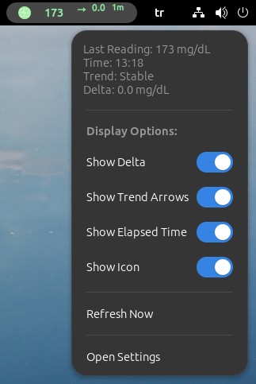
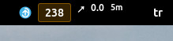
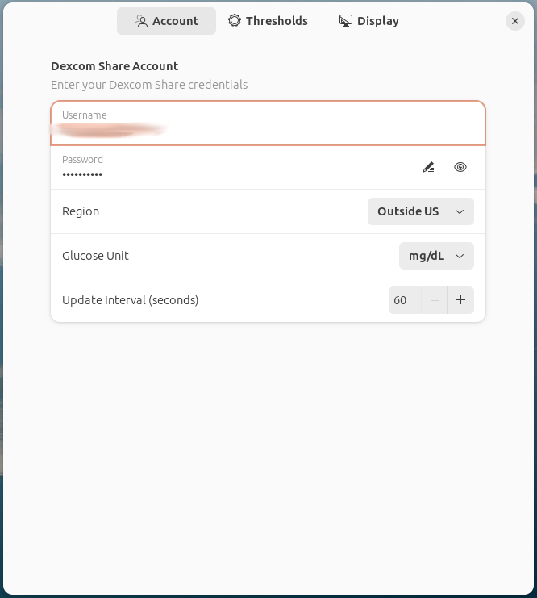
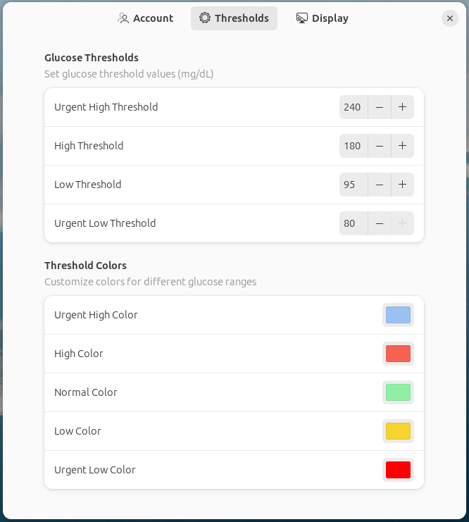
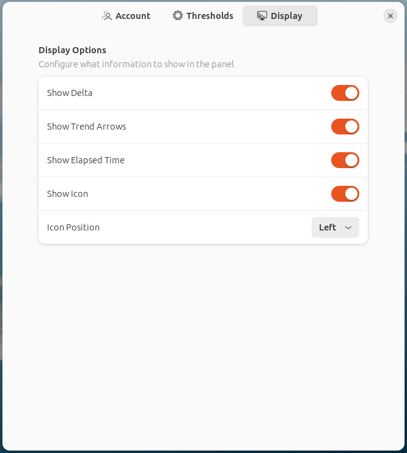

# Dexcom Blood Glucose Monitor GNOME Extension


A GNOME Shell extension that seamlessly integrates with Dexcom Share to display real-time blood glucose levels in your GNOME top panel.

**⚠️ Important Notice:** This extension is not affiliated, funded, or in any way associated with Dexcom.

## ✨ Features

- **Real-time Monitoring**: Display current glucose levels directly in your GNOME top panel
- **Visual Indicators**: 
  - Dynamic trend arrows showing glucose direction
  - Delta values indicating glucose changes
  - Elapsed time since last reading
  - Color-coded display based on glucose ranges
- **Smart Settings**: 
  - Customizable glucose thresholds
  - Visual alerts
  - Support for both mg/dL and mmol/L units
- **Customizable Display**:
  - One-click manual refresh
  - Configurable update intervals
  - Toggle delta values, trend arrows, and time display
  - Adjustable icon position

## 📸 Screenshots






## ⚙️ Configuration Screenshots





## 🚀 Installation

### 🌐 From GNOME Extensions Website
1. Visit [GNOME Extensions](https://extensions.gnome.org)
2. Search for "Dexcom Blood Glucose Monitor"
3. Click "Install"

### 💻 Manual Installation
1. Clone this repository:
   ```bash
   git clone https://github.com/faymaz/dexcom
   ```
2. Copy to GNOME extensions directory:
   ```bash
   cp -r dexcom ~/.local/share/gnome-shell/extensions/dexcom@faymaz.github.com
   ```
3. Restart GNOME Shell:
   - For X11 sessions: Press Alt+F2, type 'r', press Enter
   - For Wayland sessions: Log out and log back in
4. Enable the extension:
   - Using GNOME Extensions app
   - Or via command line:
     ```bash
     gnome-extensions enable dexcom@faymaz.github.com
     ```

## ⚙️ Configuration

1. Access Settings:
   - Click the extension icon in the top panel and select "Open Settings"
   - Or open GNOME Extensions app and click settings on "Dexcom Blood Glucose Monitor"

2. Available Settings:
   - 👤 Account:
     * Dexcom Share username and password
     * Region (US or Non-US)
     * Unit preference (mg/dL or mmol/L)
     * Update interval (60-600 seconds)
   - 📊 Thresholds:
     * Customize glucose threshold values
     * Set color schemes for different ranges
   - 🎨 Display:
     * Toggle delta values
     * Toggle trend arrows
     * Toggle elapsed time
     * Configure icon visibility and position

## 🔒 Privacy & Security

- Your Dexcom Share credentials are required for operation
- Credentials are stored securely using GNOME's GSettings
- All data is fetched directly from Dexcom servers using HTTPS
- No third-party data collection or transmission
- Open source code available for security review

## 💻 Compatibility

- GNOME Shell 45, 46, and 47
- Requires active Dexcom Share account with sharing enabled
- Works with both US and Non-US Dexcom servers
- Internet connection required

## 🔧 Troubleshooting

Check GNOME Shell logs for detailed error messages:
```bash
journalctl /usr/bin/gnome-shell -f -o cat
```

Common issues:
- 🔑 Authentication errors: Verify your Dexcom Share credentials
- 📡 No data: Ensure Dexcom Share is enabled in your Dexcom app
- 🌐 Connection issues: Check your internet connection

## 📜 License

This project is licensed under the GNU General Public License v3.0.

## ⚠️ Disclaimer

This software is not affiliated with Dexcom, Inc. The extension is provided "as is" without warranty of any kind. Do not make medical decisions based on this extension. Always verify glucose values using your official Dexcom receiver or app.

## 💬 Support & Contributions

- 🐛 Report issues: [GitHub Issues](https://github.com/faymaz/dexcom/issues)
- 💡 Feature requests welcome
- 🤝 Contributions welcome through pull requests

## 👤 Author

- [faymaz](https://github.com/faymaz)