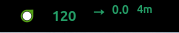
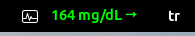
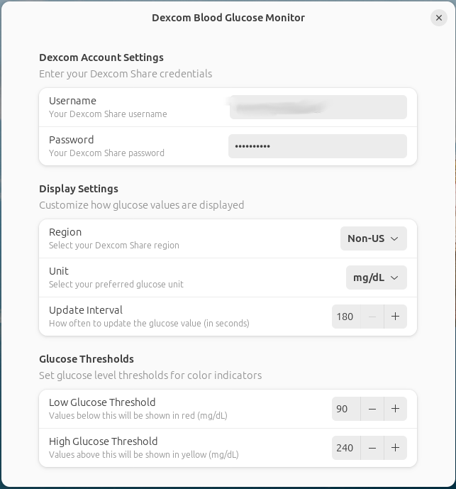

> ⚠️ **WARNING:** This Dexcom Gnome Shell extension project is currently in development and is not yet operational.







# Dexcom Blood Glucose Monitor GNOME Shell Extension

## Overview

The Dexcom Blood Glucose Monitor is a GNOME Shell extension that seamlessly integrates with Dexcom Share to display real-time blood glucose levels in the top panel. It provides visual alerts based on glucose thresholds for effective glucose monitoring.

## Features

- **Real-time Monitoring:** Displays your current blood glucose level directly in the GNOME top panel.
- **Visual Alerts:** Changes the color of the glucose value based on thresholds:
  - Green: Normal range (90 - 210 mg/dL)
  - Yellow: High glucose level (≥ 210 mg/dL)
  - Red: Low glucose level (< 90 mg/dL)
- **Automatic Updates:** Fetches new glucose data every 3 minutes.
- **User Preferences:** Allows you to set your Dexcom account username and password.

## Installation

1. **Clone the Repository:**

   ```bash
   git clone https://github.com/faymaz/dexcom.git dexcom@faymaz
   ```

2. **Install the Extension:**

   Copy the extension folder to your local GNOME Shell extensions directory:

   ```bash
   cp -r dexcom@faymaz ~/.local/share/gnome-shell/extensions/
   ```

3. **Enable the Extension:**

   - Use a tool like `gnome-extensions-app` or `gnome-tweaks` to enable the "Dexcom Blood Glucose Monitor" extension.
   - Alternatively, you can enable it via the command line:

     ```bash
     gnome-extensions enable dexcom@faymaz
     ```

4. **Restart GNOME Shell:**

   - Press `Alt + F2`, type `r`, and press `Enter` (This works on Xorg sessions).
   - For Wayland sessions, you need to log out and log back in.

## Configuration

1. **Open Preferences:**

   - Right-click on the glucose monitor icon in the top panel and select "Preferences".
   - Or use `gnome-extensions prefs dexcom@faymaz` from the command line.

2. **Set Your Dexcom Credentials:**

   - Enter your Dexcom account username and password.
   - **Note:** Your credentials are stored using GNOME's settings system, which is not encrypted. Be cautious about security.

## Requirements

- **GNOME Shell 46** or later.
- **Dexcom Account:** You need a valid Dexcom Share account to use this extension.

## Disclaimer

- **Security Warning:** This extension stores your Dexcom account credentials in plain text within GNOME's settings system. Use at your own risk.
- **Not Affiliated with Dexcom:** This project is not affiliated with Dexcom, Inc. Use of this extension is at your own discretion.
- **API Usage:** Ensure that you comply with Dexcom's terms of service when using this extension.

## Troubleshooting

- **Extension Not Showing Up:** Make sure you've copied the extension to the correct directory and that GNOME Shell recognizes it.
- **Logs and Errors:** You can check GNOME Shell logs for errors using:

  ```bash
  journalctl /usr/bin/gnome-shell -f -o cat
  ```

## Contributing

Contributions are welcome! Please open an issue or submit a pull request on GitHub.

## License

[MIT License](LICENSE)

## Disclaimer

This project is not affiliated with Dexcom, Inc. Use at your own risk. Do not use this library for making medical decisions. Always verify glucose values using your official Dexcom receiver or app.

## Author

- [faymaz](https://github.com/faymaz)

